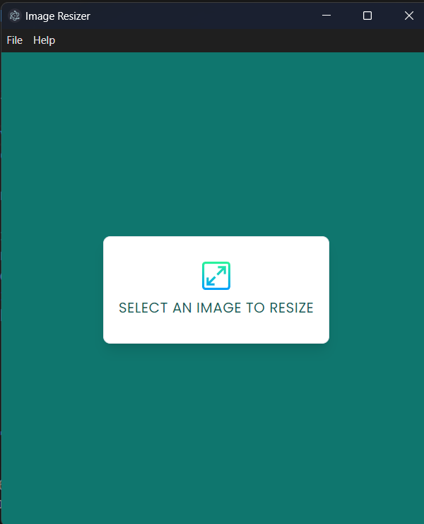
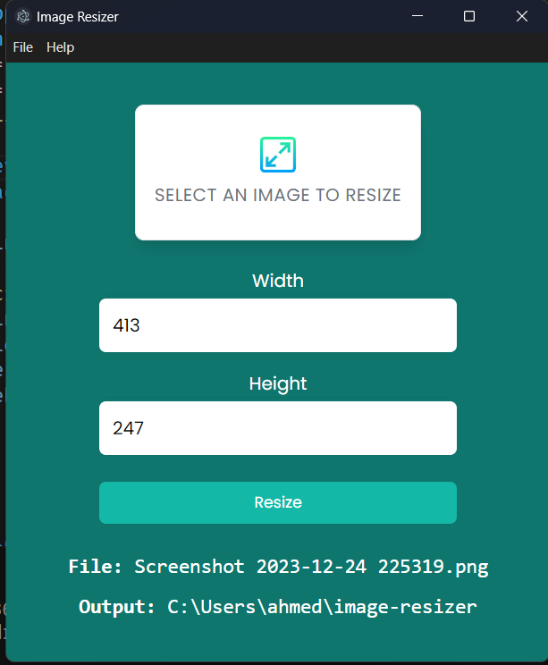

# Image Resizer

This is an image resizer desktop application built with Electron.js. It allows you to resize images to a custom size.

## Installation

1. Clone the repository
2. Run `npm install`
3. Run `npm start`
4. Run `npm run make` to build the executable file

## Usage

1. Select an image
2. Choose the desired width and height
3. Click on the "Resize" button
4. The resized image will be saved in the output folder which will be created and opened automatically

## Demo

